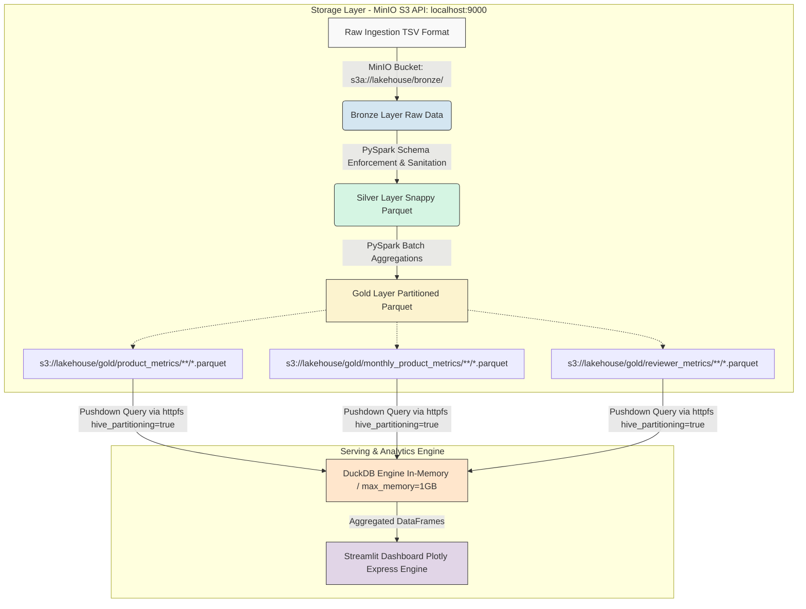

# Arquitetura & Documentação Técnica: Azure Lakehouse Reviews

## 1. Visão Geral do Sistema e Topologia

Este repositório contém a implementação de referência de um Data Lakehouse analítico seguindo o padrão de Arquitetura Medalhão. O mecanismo de processamento distribuído utiliza Apache Spark (PySpark) para higienização e agregações analíticas sobre o MinIO Object Storage (compatível com API AWS S3 V4). 

A camada de servimento e consumo analítico é totalmente desacoplada, utilizando **DuckDB** com a extensão `httpfs` para *pushdown queries* vetorizadas em memória diretamente dos arquivos Parquet particionados. Os dados consolidados alimentam um dashboard interativo construído em **Streamlit + Plotly Express**.



---

## 2. Matriz de Compatibilidade de Software e Especificações do Ambiente

O ambiente de execução exige paridade rigorosa entre os conectores do ecossistema Hadoop AWS, o runtime do Spark e os clientes de consulta OLAP para garantir a integridade das chamadas de API S3 e evitar gargalos.

| Componente | Versão Alvo | Binários / Pacotes Especificados | Escopo de Execução |
| :--- | :--- | :--- | :--- |
| **Sistema Operacional** | Fedora Linux / Ubuntu | Kernel 5.15+ (x86_64, zsh/bash) | Sistema Hospedeiro |
| **Container Engine** | Docker Engine 24.0+ | Docker Compose v2.20+ | Isolamento de Runtime |
| **Apache Spark** | 3.5.x | PySpark Runtime (Python 3.10+) | Computação Distribuída |
| **Hadoop AWS S3A** | 3.3.4 | `org.apache.hadoop:hadoop-aws:3.3.4` | Conector do Protocolo S3A |
| **Storage de Objetos** | MinIO RELEASE.2023+ | S3 API V4 (`http://localhost:9000`) | Armazenamento Data Lake |
| **Motor de Consulta OLAP**| DuckDB 0.9.x+ | Extensão `httpfs` (`max_memory='1GB'`) | Consultas Vetorizadas In-Memory |
| **Frontend / Dashboard** | Streamlit 1.30+ | Python 3.10+ | UI Analítica |
| **Motor de Gráficos** | Plotly Express | `plotly>=5.18.0` (`width='stretch'`) | Renderização Vetorial |

---

## 3. Fluxo de Dados & Especificações da Camada Medalhão

### 3.1. Camada Bronze (Armazenamento Bruto)
* **Caminho:** `s3a://lakehouse/bronze/amazon_reviews/books/data.tsv`
* **Formato:** TSV (Tab-Separated Values), Codificação UTF-8.
* **Estratégia:** Schema-on-Read. Ingestão bruta sem mutações estruturais.

### 3.2. Camada Silver (Limpa & Estruturada)
* **Caminho:** `s3a://lakehouse/silver/amazon_reviews/books/`
* **Formato:** Apache Parquet (Compactação Snappy).
* **Transformações:**
  * **Tipagem Estrita:** `star_rating` (Integer), `helpful_votes` (Integer), `total_votes` (Integer).
  * **Normalização Temporal:** `review_date` convertido via padrão ISO-8601 (`yyyy-MM-dd`).
  * **Saneamento:** Eliminação de registros nulos (`review_id IS NOT NULL`).
  * **Particionamento:** Extração de `review_year` e `review_month`.

### 3.3. Camada Gold (Data Marts Analíticos em Parquet)
As agregações de negócio são armazenadas fisicamente no MinIO em formato Parquet:

* **Métricas de Produtos (`product_metrics`):**
  * **Esquema:** `asin`, `total_reviews`, `avg_rating`, `sum_rating`, `rejection_rate_pct`, `first_review_date`, `last_review_date`.
* **Séries Temporais Mensais (`monthly_product_metrics`):**
  * **Particionamento Hive:** `review_year=YYYY/review_month=MM/`
  * **Esquema:** `asin`, `review_year`, `review_month`, `monthly_reviews`, `monthly_avg_rating`.
* **Métricas de Avaliadores (`reviewer_metrics`):**
  * **Esquema:** `reviewerID`, `total_reviews_written` (ou `total_reviews_by_reviewer`), `avg_rating_given`, `first_active_date`, `last_active_date`.

---

## 4. Formulações Matemáticas & Regras de Negócio

### 4.1. Avaliação Média ($\bar{R}_p$)
Dado o conjunto de avaliações $S_p$ para um produto $p$, onde $r_i$ é a nota atribuída na avaliação $i$ e $n = |S_p|$ é o total de avaliações:

$$\bar{R}_p = \text{round}\left( \frac{1}{n} \sum_{i=1}^{n} r_i, 2 \right)$$

### 4.2. Taxa de Rejeição de Produto ($\text{TauxRej}_p$)
Percentual de avaliações de um produto com nota crítica desfavorável ($r_i \le 2$):

$$\text{TauxRej}_p = \text{round}\left( \frac{\sum_{i=1}^{n} \mathbb{I}(r_i \le 2)}{n} \times 100, 2 \right)$$

Onde $\mathbb{I}(\cdot)$ é a função indicadora:

$$\mathbb{I}(A) = \begin{cases} 1, & \text{se } A \text{ é verdadeiro} \\ 0, & \text{se } A \text{ é falso} \end{cases}$$

### 4.3. Avaliação Média Mensal ($\bar{M}_{p, t}$)
Dado um produto $p$ em uma partição temporal $t = (\text{ano}, \text{mês})$ com volume de avaliações $k_t$:

$$\bar{M}_{p, t} = \text{round}\left( \frac{1}{k_t} \sum_{j=1}^{k_t} r_{j, t}, 2 \right)$$

---

## 5. Complexidade Algorítmica & Análise Big O

### 5.1. Pipeline de Transformação da Camada Silver
Considere $N$ como o total de registros brutos no TSV e $M$ como a quantidade de atributos.

* **Complexidade de Tempo:**
  * **Parsing & Cast:** $\mathcal{O}(N \cdot M)$.
  * **Serialização Parquet Snappy:** $\mathcal{O}(N \cdot M)$.
  * **Geral:** $\mathcal{O}(N)$ (linear em relação ao volume).
* **Complexidade de Espaço:**
  * **Memória Volátil:** $\mathcal{O}(B \cdot K)$ por executor Spark ($B$ = tamanho do lote, $K$ = bytes por linha). Impede estouro $\mathcal{O}(N)$.

### 5.2. Pipeline de Agregação da Camada Gold
Considere $N$ registros Silver, $U$ produtos únicos (`asin`) e $A$ avaliadores únicos (`reviewerID`).

* **Complexidade de Tempo:**
  * **Map-side & Shuffle:** $\mathcal{O}(N \log K)$.
  * **Reduce (Agregação Final):** $\mathcal{O}(U)$ para produtos, $\mathcal{O}(A)$ para usuários.
  * **Geral:** $\mathcal{O}(N + U \log U + A \log A)$.
* **Complexidade de Espaço:**
  * **Disco/MinIO:** $\mathcal{O}(U + A + T)$ em arquivos Parquet.

### 5.3. Camada Analítica DuckDB (Pushdown)
* **Complexidade de Tempo:** $\mathcal{O}(P + F)$, onde $P$ é o custo de Partition Pruning e $F$ é o número de blocos scaneados via requisições HTTP Range.
* **Complexidade de Espaço:** Restrito via engine para `SET max_memory='1GB'`, forçando *spill to disk* interno caso a projeção exceda a RAM local do dashboard.

---

## 6. Guia de Execução e Inicialização do Ambiente

### 6.1. Inicialização da Infraestrutura
Na raiz do repositório, suba o cluster via Docker Compose:

```bash
docker compose up -d
# Validar saúde do MinIO
curl -I http://localhost:9000/minio/health/live
```

### 6.2. Submissão dos Jobs PySpark (ETL Batch)
Acione o processamento Medallion de ponta a ponta:

```bash
# Processamento Bronze -> Silver
docker exec -it lakehouse-spark spark-submit \
  --packages org.apache.hadoop:hadoop-aws:3.3.4 \
  /home/jovyan/work/process_silver.py

# Processamento Silver -> Gold
docker exec -it lakehouse-spark spark-submit \
  --packages org.apache.hadoop:hadoop-aws:3.3.4 \
  /home/jovyan/work/process_gold.py
```

### 6.3. Inicialização do Dashboard Streamlit
Inicie a aplicação de visualização (garanta que porta 8501 esteja livre):

```bash
streamlit run app.py --server.port 8501 --server.headless true
```
